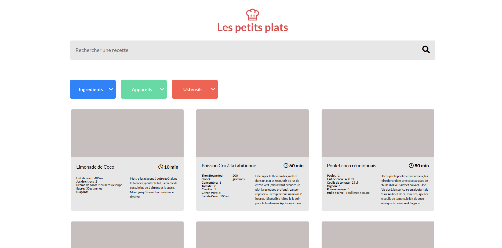

LES PETIT PLATS
================

Algorithme de recherche de recettes de cuisine, par mots clés et par tags.

Filtrage dynamiques des recettes dès que l'utilisateur saisie des mots clés ou des tags.

Installation
------------

Aucune dépendance, ouvrir le fichier `index.html`

Live démo
--------
[Lien vers Les Petits plats](https://geo-tp.github.io/Les-Petits-Plats/)